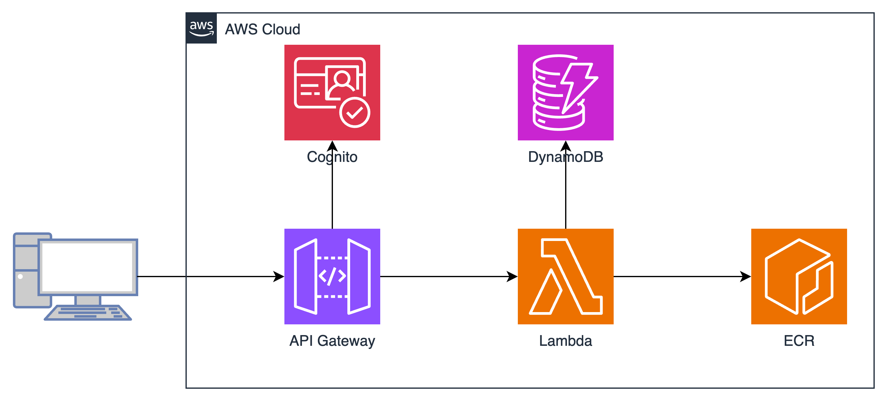

# ランチアプリ

## AWS環境のリソース準備

### 前提

- 本プロジェクトではTerraformを使って、リソースの作成を行います。Terraformがインストール済みを前提としています。

### 作成されるリソース構成



### 手順

```bash
cd terraform
terraform plan
terraform apply
```

## FastAPIアプリ開発

### 前提

- 本プロジェクトの依存関係の管理はpoetryを使用しています。poetryがインストール済みを前提としています。

### 手順

1. アプリのルートディレクトリに移動して、各依存関係をインストールします。

```bash
cd api
poetry install
```

## FastAPIアプリコンテナイメージデプロイ

### 前提

- Dockerがインストール済みを前提としています。

### 手順

1. アプリのルートディレクトリに移動して、各依存関係

```bash
cd api
```

2. AWSコンソール上の`fastapi-lunch-blog-app-ecr`リポジトリにアクセスし、`プッシュコマンドの表示`ボタンより表示するコンテナーイメージをpush手順を確認します。
3. 上記の手順に従って、アプリのコンテナイメージをビルドし、pushします。
4. Lambdaが新しいコンテナイメージを起動するように、AWS環境のリソース準備の手順に従ってもう一度Lambdaをデプロイします。
